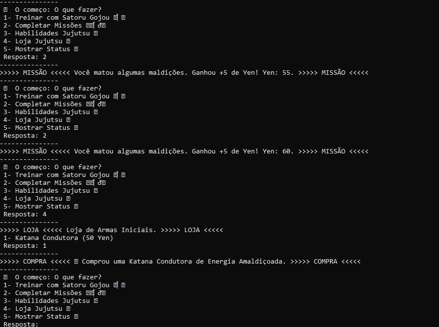

# ⚔️ Jujutsu Academy

[](https://git.io/typing-svg)


O **Jujutsu Academy** é um RPG de texto jogado no terminal, inspirado em Jujutsu Kaisen. Você começa como um aluno sem rank, treina, completa missões, aprende técnicas e compra armas amaldiçoadas até chegar ao Grau Especial e enfrentar o Sukuna. Tudo é controlado digitando o número da opção desejada.

***Última versão:*** $\color{green}{\textsf{jujutsu-academy-latest.py}}$
- Versão sem bugs, otimizada e com gameplay melhor.

***Primeira versão:*** $\color{red}{\textsf{jujutsu-academy-old.py}}$
- A primeira e mais antiga versão do jogo. Não recomendada, pois tem bugs e uma gameplay pior.

---

## 📸 Demonstração



---

## ✍ Funcionalidades

### 1. Treinamentos e Missões
Comece se alistando na Academia Jujutsu, onde você passa por um teste: dar 10 socos até despertar sua energia amaldiçoada. Depois disso, você vira um feiticeiro de **Grau 4** e pode treinar com Satoru Gojou para ganhar experiência (XP) ou completar missões para ganhar dinheiro (Yen).

### 2. Lojas e Compras
Use o XP para aprender novas técnicas e o Yen para comprar armas amaldiçoadas. O jogo avisa quando faltam recursos e impede que você compre o mesmo item duas vezes.

### 3. Status e Rank Up
A opção **5** dos menus mostra seu status: Maestria, XP, Yen, técnicas aprendidas e armas no arsenal.

Para subir de grau, basta aprender todas as técnicas e comprar todas as armas do menu atual:

| Grau | Menu | Técnicas (XP) | Armas (Yen) |
|------|------|---------------|-------------|
| Sem rank | Menu inicial | 10 socos para despertar | — |
| Grau 4 | "O Começo" 🍀 | Kokusen (40), Reforço Masterizado (60) | Katana Condutora (50) |
| Grau 1 | "O Meio" 🔨 | Energia Reversa (125), Expansão de Domínio (200) | Playful Cloud (150), Kamutoke (200) |
| Grau Especial | Shinjuku Showdown 💀 | — | — |

No Grau Especial acontece a batalha final contra o Sukuna, e sua escolha decide o final do jogo.

---

## 👨‍💻 Instalação e Pré-requisitos

### Pré-requisitos
- **Python 3.6 ou superior** (o jogo usa f-strings). Baixe [aqui](https://www.python.org/downloads/) e veja o guia oficial de instalação [aqui](https://wiki.python.org/moin/BeginnersGuide/Download).
- **Nenhuma dependência externa**: o jogo usa apenas a biblioteca padrão do Python, por isso não há `requirements.txt`.
- **Opcional, mas recomendado:** um editor como o [VSCode](https://code.visualstudio.com/download) com a [extensão de Python](https://marketplace.visualstudio.com/items?itemName=ms-python.python), ou um terminal com bom suporte a emojis (no Windows, o **Windows Terminal**).

Para conferir se o Python está instalado:

```bash
python --version
```

### Instalação

1. Clone o repositório:
   ```bash
   git clone https://github.com/SEU-USUARIO/jujutsu-academy.git
   ```
2. Entre na pasta do projeto:
   ```bash
   cd jujutsu-academy
   ```
3. Rode o jogo:
   ```bash
   python jujutsu-academy-latest.py
   ```

> No Linux e no macOS, talvez seja necessário usar `python3` no lugar de `python`.

Se preferir não usar o Git, clique em **Code → Download ZIP** no GitHub, extraia a pasta e siga a partir do passo 2.

---

## ❓ Uso e Exemplos

Todo o jogo é controlado digitando o **número da opção** e apertando **Enter**. Se você digitar algo que não é número, o jogo pede de novo, sem fechar.

### Exemplo de sessão

```
#### Jujutsu Academy ####
 ---------------
Seja bem vindo ao menu, faça a sua escolha.
 1- Se alistar na academia Jujutsu
 2- Vagabundear
 Resposta: 1
---------------
 Diretor da Academia: Você deve provar a sua vontade, desperte sua maldição interior
 1- Socar o ar com toda a força
 Resposta: 1
---------------
>>>>> AÇÃO <<<<< Você socou com toda a sua força... mas ainda faltam 9 socos 👊 >>>>> AÇÃO <<<<<
```

### Opções dos menus de Grau 4 e Grau 1

| Tecla | Ação |
|-------|------|
| `1` | Treinar (ganha XP) |
| `2` | Missões (ganha Yen) |
| `3` | Menu de habilidades (gasta XP) |
| `4` | Loja de armas (gasta Yen) |
| `5` | Mostrar status |

### Dicas
- Alterne entre treinar e fazer missões para juntar XP e Yen ao mesmo tempo.
- Use o **5** com frequência para ver o que ainda falta para subir de grau.
- Deixe a janela do terminal grande o bastante para ver o texto, os emojis e a arte final.
- Para sair do jogo a qualquer momento, aperte `Ctrl + C`.

---

## 📓 Estrutura do Projeto

```
jujutsu-academy/
├── jujutsu-academy-latest.py
├── jujutsu-academy-old.py
├── LICENSE
├── README.md
└── assets/
    └── image/
        └── cli-screenshot.png
```

- **`jujutsu-academy-latest.py`**: a versão atual e recomendada do jogo, com os bugs corrigidos.
- **`jujutsu-academy-old.py`**: a primeira versão, mantida para mostrar a evolução do projeto.
- **`LICENSE`**: o texto da licença MIT, que define como o código pode ser usado.
- **`README.md`**: esta documentação, com descrição, instalação e uso.
- **`assets/image/`**: as imagens usadas no README.

---

## 👨‍⚖️ Licença

Este projeto está licenciado sob a MIT License. Veja o arquivo [LICENSE](LICENSE) para mais detalhes.
